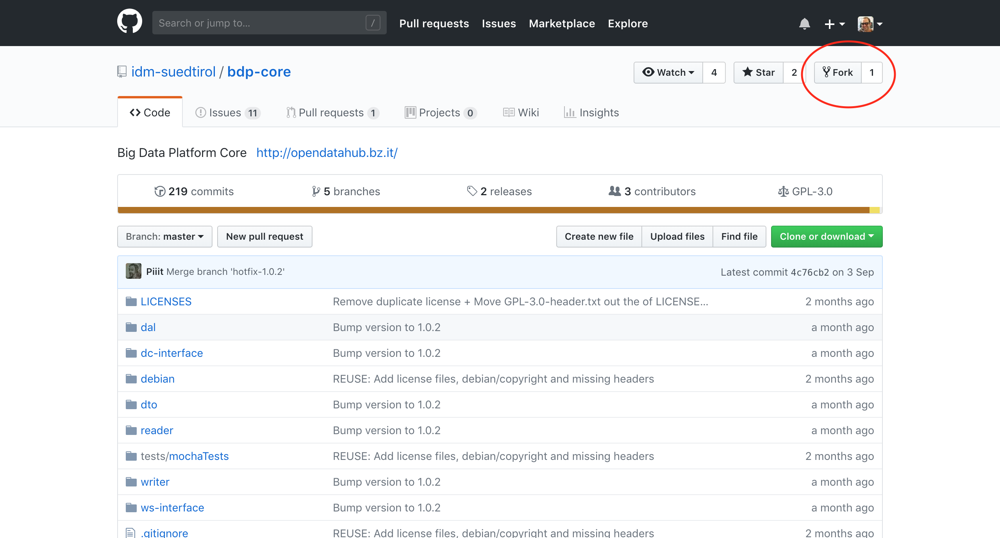
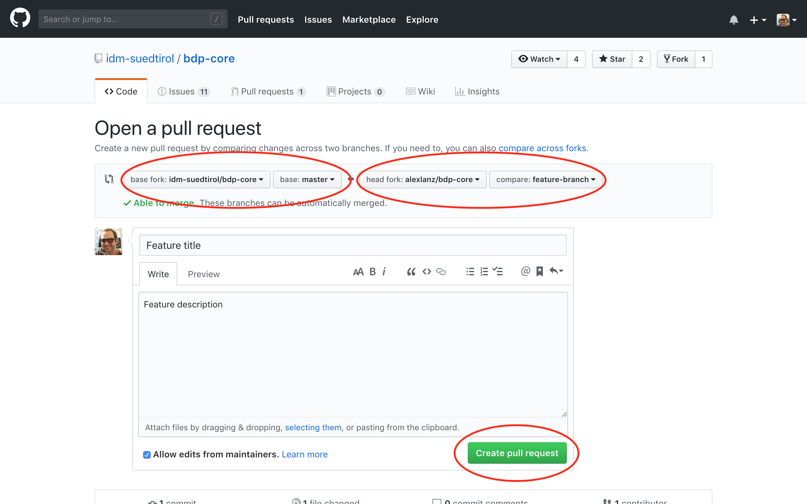
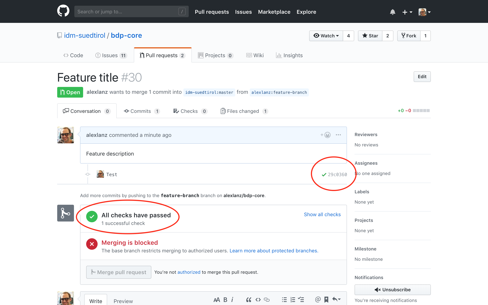

Documentation for Contributors
==============================

### Prerequisites

In the following documentation some example names are used. Please replace them with your names:

- Replace **your-username** with your username on GitHub.
- Replace **feature-branch** with your branch name.

### Project Checkout

1. Navigate to the repository on GitHub (ex: [https://github.com/idm-suedtirol/bdp-core](https://github.com/idm-suedtirol/bdp-core))

- Create a fork of the repository by clicking the button **Fork** (and selecting the user where the fork should be created)
    

- Navigate to your forked repository on GitHub (ex: [https://github.com/your-username/bdp-core](https://github.com/your-username/bdp-core))

- Checkout your forked repository on your machine (ex: `git clone git@github.com:your-username/bdp-core.git`)
    

### Pull Request

1. Checkout the **master** branch:
    `git checkout master`

- Create a new branch from the **master** branch locally on your machine:
    `git checkout -b feature-branch`

- Make some initial changes to the repository and commit them:
    `git add -A`
    `git commit -m "Some commit message"`

- Push the new branch to GitHub:
    `git push --set-upstream origin feature-branch`

- Navigate to [https://github.com/your-username/bdp-core/pull/new/feature-branch](https://github.com/your-username/bdp-core/pull/new/feature-branch) to create a new pull request
    

- Commit and push any changes of the pull request to this new branch

- For every commit the continuous integration pipeline will execute the tests and display the results in the pull request.
    

- In addition, the detailed logs can be viewed under [https://ci.opendatahub.bz.it](https://ci.opendatahub.bz.it)

### Syncing a Fork

The fork repository does not receive the updates of the original repository automatically. To sync for example the **master** branch of the two repositories and to keep the forked repository up-to-date with all the latest changes of the **master** branch from the original repository, the following steps have to be performed.

Before you can sync your fork with the original repository (an upstream repository), you must configure a remote that points to the upstream repository in Git. A more detailed description for the following steps can be found [here](https://help.github.com/articles/configuring-a-remote-for-a-fork/).

1. List the current configured remote repository for your fork.
    `git remote -v`

- Specify a new remote upstream repository that will be synced with the fork.
    `git remote add upstream https://github.com/idm-suedtirol/bdp-core.git`

- Verify the new upstream repository you've specified for your fork.
    `git remote -v`

Sync a fork of a repository to keep it up-to-date with the original repository (upstream repository). A more detailed description for the following steps can be found [here](https://help.github.com/articles/syncing-a-fork/).

1. Fetch the branches and their respective commits from the upstream repository. Commits to **master** will be stored in a local branch, **upstream/master**
    `git fetch upstream`

- Check out your fork's local **master** branch.
    `git checkout master`

- Merge the changes from **upstream/master** into your local **master** branch. This brings your fork's master branch into sync with the upstream repository, without losing your local changes.
    `git merge upstream/master`
